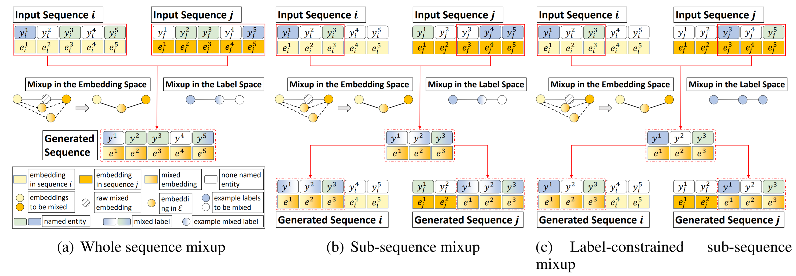

# SeqMix
The repository of our EMNLP'20 paper  
**SeqMix: Augmenting Active Sequence Labeling via Sequence Mixup**  
[[paper]](https://rongzhizhang.org/pdf/emnlp20_SeqMix.pdf)  [[slides]](https://rongzhizhang.org/slides/EMNLP20_SeqMix_Slides.pdf)  
  


# Requirements
- pytorch-transformers==1.2.0  
- torch==1.2.0  
- seqeval==0.0.5  
- tqdm==4.31.1  
- nltk==3.4.5  
- Flask==1.1.1  
- Flask-Cors==3.0.8  
- pytorch_pretrained_bert==0.6.2  

Install the required packages:  
```
pip install -r requirements.txt
```

# Key Parameters
- `data_dir`: specify the data file, we provide CoNLL-03 dataset here 
- `max_seq_length`: maximum length of each sequence  
- `num_train_epochs`: number of training epochs  
- `train_batch_size`: batch size during model training  
- `active_policy`: query policy of active learning  
- `augment_method`: augmenting method  
- `augment_rate`: augmenting rate  
- `hyper_alpha`: parameter of Beta distribution

# Run
## Active learning part
Random Sampling  
```
python active_learn.py --active_policy=random
```
Least Confidence Sampling  
```
python active_learn.py --active_policy=lc
```
Normalized Token Entropy sampling  
```
python active_learn.py --active_policy=nte
```

## Seqmix part
Whole sequence mixup
```
python active_learn.py --augment_method=soft
```
Sub-sequence mixup
```
python active_learn.py --augment_method=slack
```
Label-constrained sub-sequence mixup
```
python active_learn.py --augment_method=lf
```

